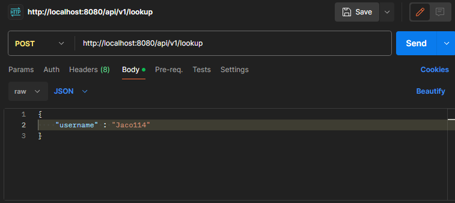

# RepoLookup

This application retrieves and prepares information about repositories and their branches of a given user.
<strong>Repositories that are forks are omitted from the response</strong>

<br>

## Available Endpoints
| Method |      Path      |    Media Type     |  Takes   |
|:------:|:--------------:|:-----------------:|:--------:|
| POST   | /api/v1/lookup | application/json  | username |

<br>


## Example Usage

To get information about user repositories we can send following request:


#### Curl
```
curl --location 'http://localhost:8080/api/v1/lookup' \
--header 'Content-Type: application/json' \
--data '{
    "username" : "Jaco114"
}'
```

<br>

#### Postman



<br>


## Example Response
<details>
<summary>Click to show response</summary>

```json
[
  {
    "name": "RepoLookup",
    "owner": {
      "login": "Jaco114"
    },
    "branches": [
      {
        "name": "feature/lookup-user-repo-info",
        "commit": {
          "sha": "2814d93d7de813814fa11593892451c798e44562"
        }
      },
      {
        "name": "master",
        "commit": {
          "sha": "b6c7b9e1ff1be0db59d15af76b4eb01ecd91eed3"
        }
      }
    ]
  },
  {
    "name": "UniversityProject",
    "owner": {
      "login": "Jaco114"
    },
    "branches": [
      {
        "name": "master",
        "commit": {
          "sha": "11b15955e58092e5a4f4fd65ca0a7c0a124bc8dd"
        }
      }
    ]
  }
]
```
</details>


